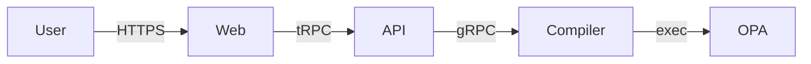

# Threat models — STRIDE per non-trivial feature

Per ADR 014 + ADR 016, every non-trivial feature ships a STRIDE threat
model file in this directory. Required as part of the implementation PR.

## Definition of "non-trivial"

Touch points that **require** a threat model:

- Authentication, authorization, multi-tenancy boundaries.
- LLM calls, RAG retrieval, prompt assembly.
- Generated artifact handling (Rego, Ansible, Kyverno, etc.).
- Signing, evidence chain, audit trail.
- New ingress endpoint (HTTP, gRPC, NATS subject exposed externally).
- New outbound network call (third-party API, collector target).
- Cryptographic primitive added or changed.
- Persistence schema change touching tenant-scoped data.
- New AI worker tool.

If unsure: write the threat model. It's 30-45 minutes of insurance.

## Trivial (no threat model needed)

- UI text, copy edits, accessibility tweaks.
- Dependency bumps with no behavior change.
- Code refactors with identical behavior.
- Internal documentation updates.
- Test additions for existing code.

## Template

Copy to `docs/threat-models/<feature-slug>.md` and fill:

```markdown
# Threat model — <Feature name>

- **Status**: Draft | Reviewed | Live
- **Date**: YYYY-MM-DD
- **Reviewer**: <name>
- **Related PR**: #<num>
- **Component(s)**: e.g., apps/api, services/compiler

## 1. Asset(s)

What does this feature handle that an attacker would want to compromise?

- Asset 1: ... (sensitivity: low | medium | high | critical)
- Asset 2: ...

## 2. Trust boundaries / data flow

Brief data flow diagram (text or mermaid):



Trust boundaries: where untrusted data enters trusted zones.

## 3. STRIDE threats

For each category, list realistic threats and the mitigations applied.

### Spoofing
- Threat: ...
  - Mitigation: ...
  - Residual risk: ...

### Tampering
- Threat: ...
  - Mitigation: ...

### Repudiation
- Threat: ...
  - Mitigation: ...

### Information disclosure
- Threat: ...
  - Mitigation: ...

### Denial of service
- Threat: ...
  - Mitigation: ...

### Elevation of privilege
- Threat: ...
  - Mitigation: ...

## 4. LLM-specific (if AI-touching)

For any feature touching LLM calls, also enumerate the relevant items
from OWASP LLM Top 10 (cf. ADR 014):

- LLM01 Prompt injection: ...
- LLM02 Sensitive info disclosure: ...
- LLM06 Excessive agency: ...
- LLM10 Unbounded consumption: ...
- (others as relevant)

## 5. Mitigations summary

| # | Mitigation | Where implemented | Verified by |
|---|---|---|---|
| 1 | ... | `services/foo/...` | unit test, eval fixture, manual review |

## 6. Accepted residual risks

Risks consciously left in scope (with rationale + revisit date).

## 7. Open questions

Items the reviewer wants discussed in PR review.
```

## Initial threat model files (to create as features land)

Tracked in roadmap:

- `multi-tenant-isolation.md` — before any tenant-scoped code (M1).
- `api-gateway.md` — with first protected tRPC procedure (M1).
- `llm-router.md` — with LLM Router scaffolding (M1).
- `document-extraction.md` — with first PDF parsing endpoint (M2).
- `ai-workers.md` — with first PydanticAI agent (M2).
- `pyramid-validation.md` — with validator port (M3).
- `policy-compilation.md` — with first Rego generator (M4).
- `audit-trail.md` — with evidence blob signing (M5+).
- `edge-agent.md` — with edge agent rewrite (M7+).
- `collectors.md` — with Proxmox collector (M7+).
- `web-app.md` — when public surface lands (M5).
- `cli.md` — with first CLI mutating command (M3).
- `approval-workflow.md` — with approval primitives (M7+).

## Review cadence

- Each model reviewed at creation (PR review).
- Re-review quarterly for active components.
- Re-review on any significant change to the feature.
- Stale models (>1 year without review) flagged at quarterly cycle.

## References

- STRIDE methodology: <https://learn.microsoft.com/en-us/azure/security/develop/threat-modeling-tool>
- OWASP Threat Modeling: <https://owasp.org/www-community/Threat_Modeling>
- ADR 014 — Security by design
- ADR 016 — Secure SDLC
